[简体中文](README.zh_CN.md) · **English**

# Codex Passport Companion

<p align="center">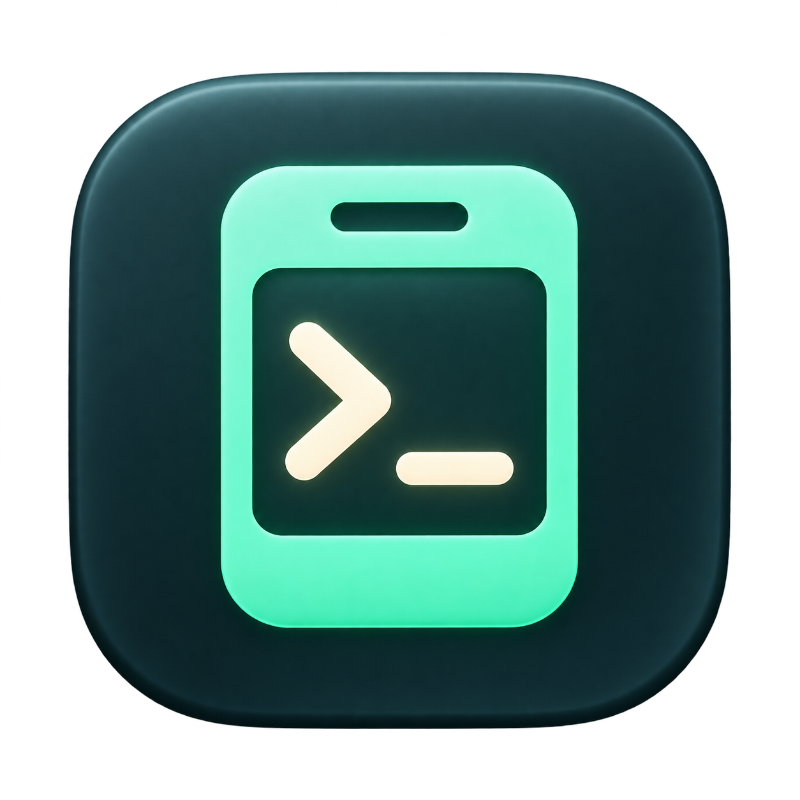</p>

A pocket Codex companion for [FoloToy AI Passport](https://gitee.com/FoloToy/ai-passport):
review voice input, switch conversations, read replies and check weekly quota on
a 240 × 320 card. The Mac runs Codex and local speech recognition; the card is a
lightweight display, microphone and controller. An independent offline firmware
provides a clock, Pomodoro timer and stopwatch.

This is a community application derived from FoloToy's complete project. It is
not an official OpenAI or FoloToy product. The default application branch is
`master`, including the P1 and desktop updates. Upstream history and the reusable
BSP are retained; the earlier feature branches remain available.

## Screenshots

### On your Mac

Native connection dashboard, local voice recognition, quiet-hours settings and USB firmware flashing.
The app follows the macOS light/dark appearance.

<p align="center">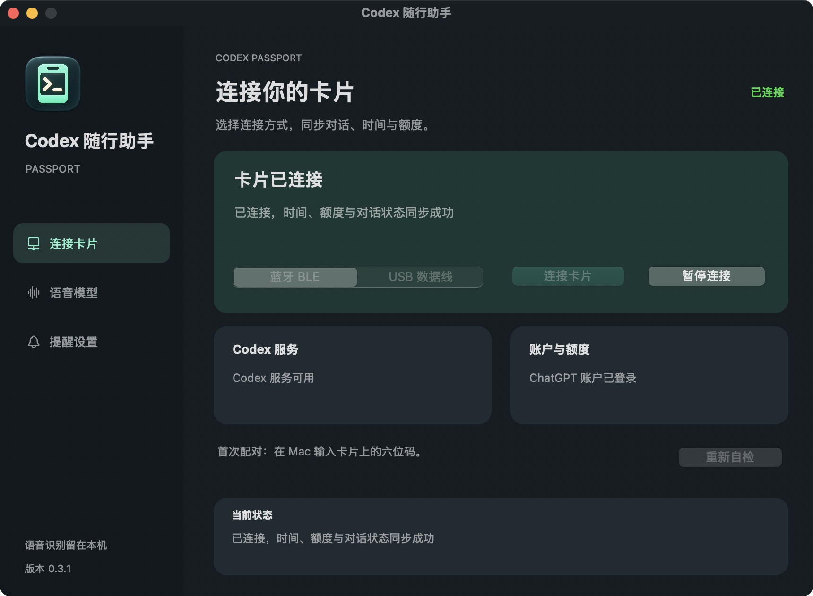</p>

| Local voice model · dark | Alert settings · light |
| --- | --- |
| 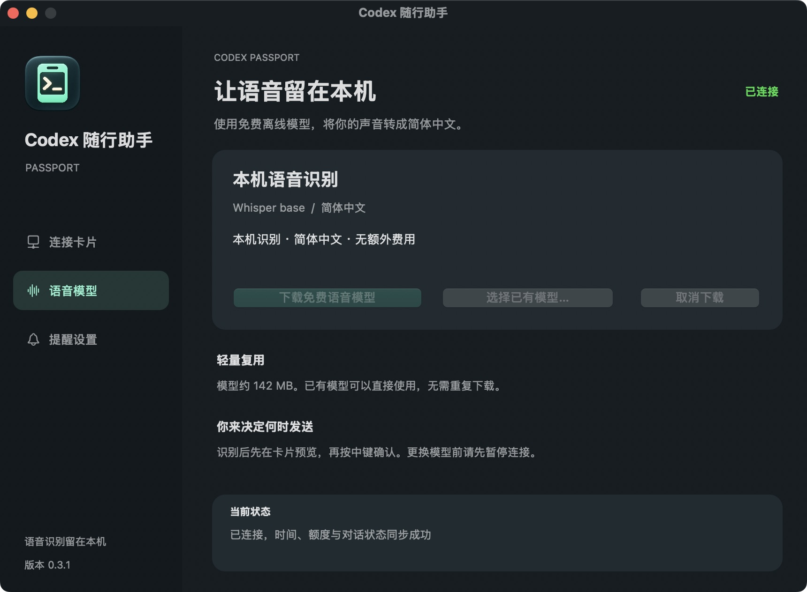 | 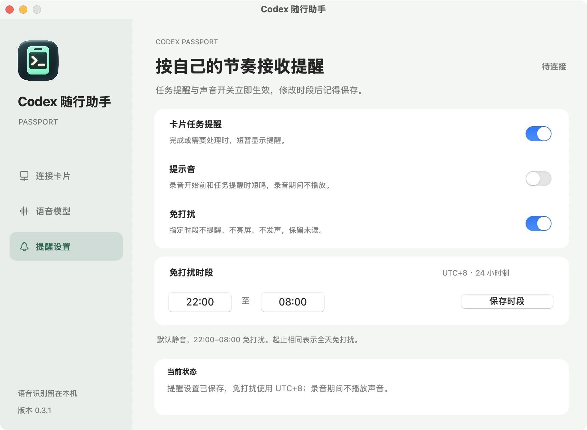 |

USB firmware flashing in desktop 0.4.0; the device shown here is an isolated preview fixture.

<p align="center">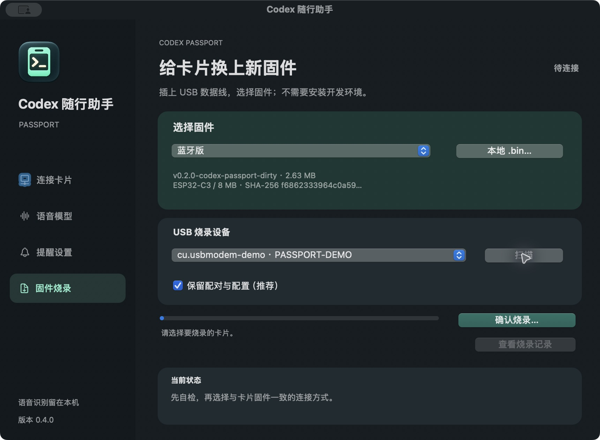</p>

Desktop 0.6.0 adds a diagnostic console. This native preview uses public sample
events, not a recording of this card's communication.

<p align="center">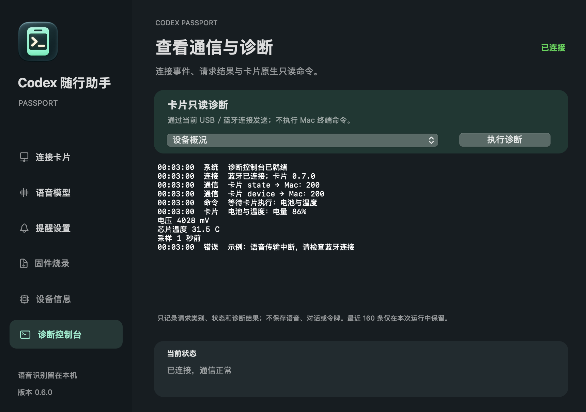</p>

### Device information

Desktop 0.8.1 adds a battery bar chart: open Device Info, then the battery history
button. Switch between the last 24 hours and seven days, select a card and click
a bar for its timestamp, percentage and voltage. Gaps remain blank; red means
≤20%, and charging is not inferred. These native light/dark previews use fictional data.

| Battery history · dark | Battery history · light |
| --- | --- |
| 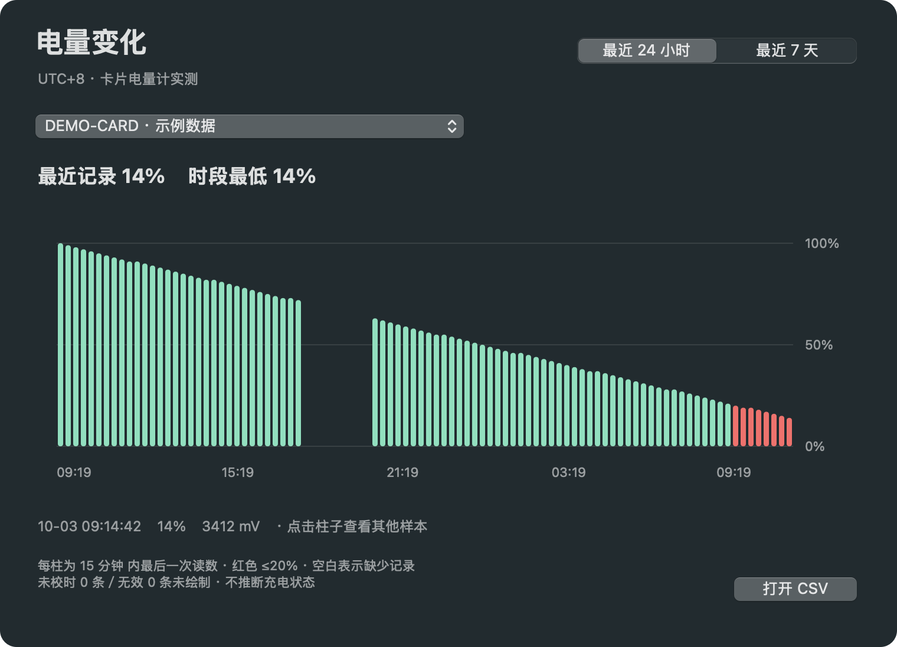 | 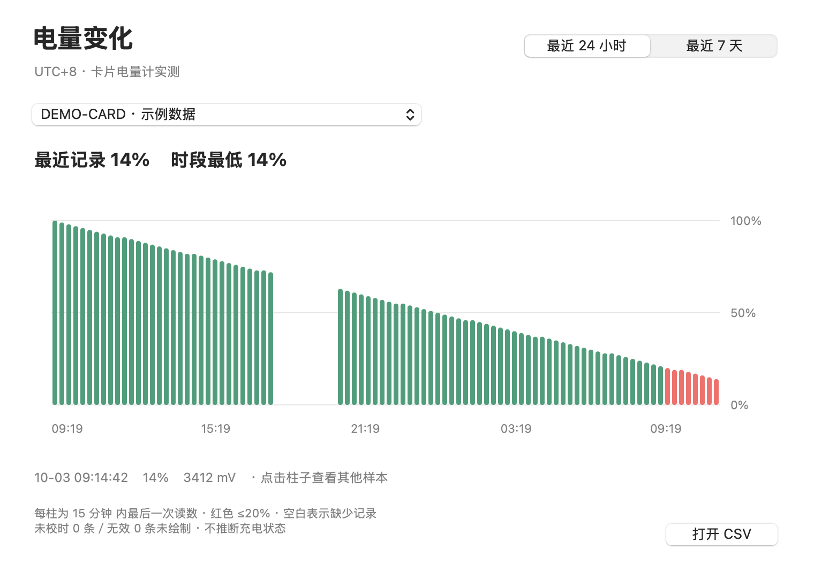 |

Desktop 0.5.0 adds local hardware monitoring and firmware comparison. These
native previews use fictional readings; they are not hardware measurements.

| Device overview | Hardware details |
| --- | --- |
| 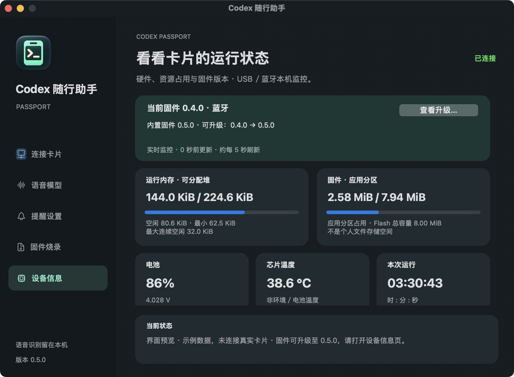 | 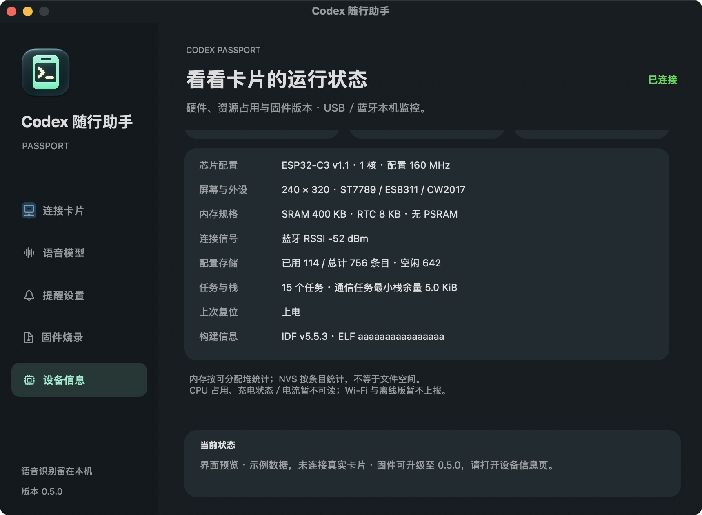 |

### On your card

Firmware 0.6.0 adds a one-screen device summary. From quota, click down; middle
returns. It works without a Mac connection, including in the offline profile.

| Companion device page | Offline device page |
| --- | --- |
| 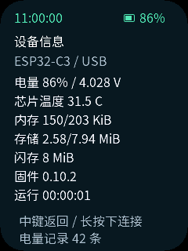 | 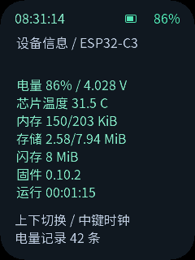 |

| Weekly quota | Recent conversations | Recording feedback | Task complete |
| --- | --- | --- | --- |
| 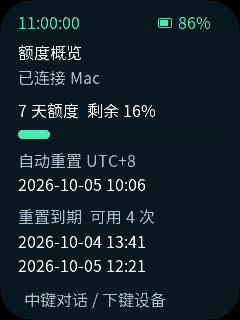 | 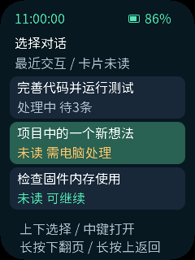 | 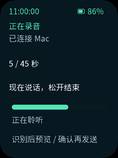 | 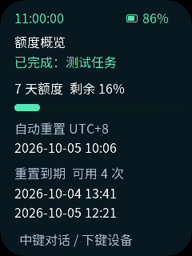 |

| Offline clock | Pomodoro | Stopwatch |
| --- | --- | --- |
| 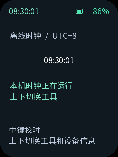 | 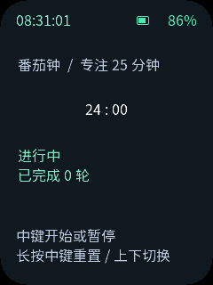 | 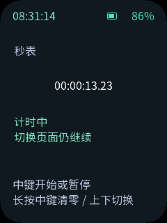 |

Firmware 0.10.0 records battery percentage and voltage in all four profiles,
including while unplugged and disconnected. BLE/USB/Wi-Fi replay retained records
over their normal connection; offline imports and syncs time over USB. Desktop
0.9.0 saves one deduplicated CSV for the chart. All card device pages show record
count; compatible configuration-preserving profile changes retain the same log.
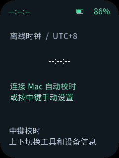

Mac connection/voice dark screenshots show the packaged app; the light settings and firmware-page screenshots use
isolated sample data. Card images are **real LVGL renders at 240 × 320 with
sample data**, not device photographs or hardware acceptance evidence. UI text is
Simplified Chinese. [Capture sources and reproduction](assets/images/codex/README.md).

Firmware 0.10.1 labels cached quota values when refresh fails, or shows unknown when no cache exists. Conversation and draft updates remain available.

| Cached quota | Quota unavailable |
| --- | --- |
| 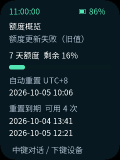 | 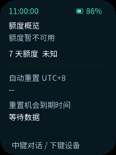 |

Desktop 0.9.2: retained-draft monitoring and Bluetooth errors, rendered with synthetic data.

| Draft monitoring | Connection error |
| --- | --- |
| 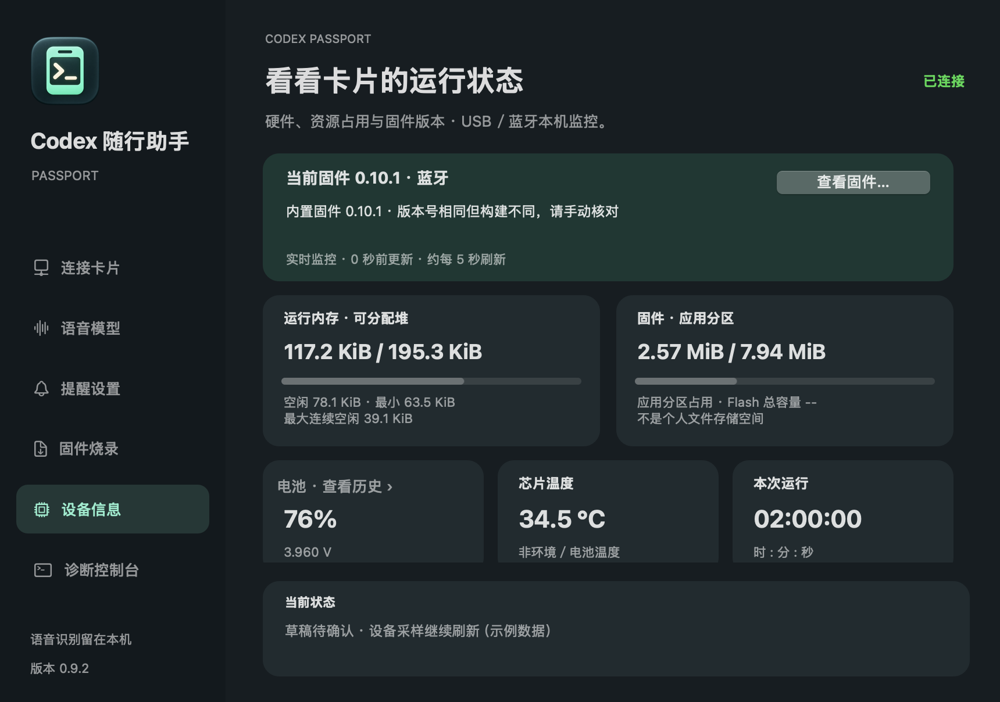 | 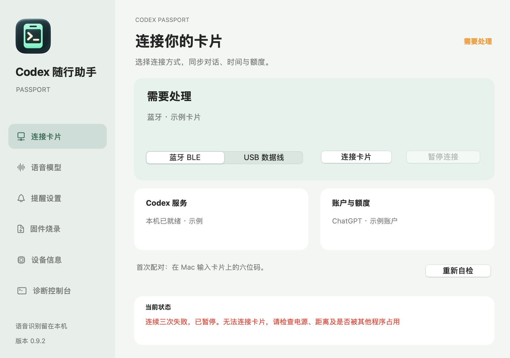 |

Firmware 0.10.2 adds a filled battery icon: red at 0–20%, yellow at 21–50%, green at 51–100%; unknown readings use an empty gray icon and `--`. Shared across all four profiles. Actual LVGL sample renders:

| 20% · Red | 50% · Yellow | 100% · Green |
| --- | --- | --- |
| 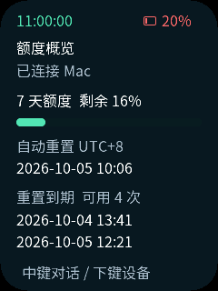 | 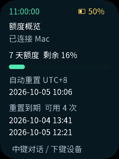 | 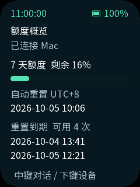 |

## Latest updates

| Batch · date | Changes | Upgrade |
| --- | --- | --- |
| 017 · 2026-10-03 | Battery icon and red/yellow/green percentage in all four profiles | Flash matching firmware 0.10.2; no desktop update required |
| 016 · 2026-10-03 | Background quota refresh, phase-specific BLE errors and fresh telemetry during draft review | Desktop 0.9.2 only; no flash required for this batch |
| 015 · 2026-10-03 | Draft standby keeps battery logging; quota failures preserve chat/drafts, with strict checks before sending | Desktop 0.9.1 and firmware 0.10.1 |
| 014 · 2026-10-03 | Shared on-card battery history across BLE, USB, Wi-Fi and offline; bounded replay and durable acknowledgments; record count in every device page | Desktop 0.9.0 and matching firmware 0.10.0 |
| 013 · 2026-10-03 | Native battery bar chart: 24 hours/seven days, per-card history, sample inspection, light/dark appearance and honest gaps | Update desktop 0.8.1; data collection still requires offline 0.9.0 from batch 012 |
| 012 · 2026-10-03 | Offline battery history: samples on the unplugged card, automatic CSV import on USB return, record count on device page | Update desktop 0.8.0 and flash offline 0.9.0; USB power is unnecessary during measurement |
| 011 · 2026-10-03 | Offline clock syncs from Mac over USB after flashing and on reconnection, while retaining manual setting | Update desktop 0.7.0 and flash offline 0.8.0; unplug for independent use |
| 010 · 2026-10-03 | Desktop 0.6.0 diagnostic console: connection/request/error history and native read-only card commands; firmware 0.7.0 for USB/BLE command replies | Replace Mac app; flash matching USB/BLE firmware to execute commands |
| 009 · 2026-10-02 | Firmware 0.6.0: local card device page in all four profiles, shared battery/resource sampling | Flash matching firmware; desktop 0.5.0 remains compatible |
| 008 · 2026-10-02 | Consolidate batches 005–007 and BLE 0.5.0 device evidence into local `master` | Source/documentation only |
| 007 · 2026-10-02 | Desktop/firmware 0.5.0: hardware information, local USB/BLE monitoring and firmware comparison | Replace Mac app and flash the matching card firmware |
| 006 · 2026-10-02 | Stable listening hint; pauses no longer trigger a low-volume warning | Flash the updated companion firmware; Mac app unchanged |
| 005 · 2026-10-02 | Desktop 0.4.0: four bundled profiles, USB flashing, pairing/configuration preservation by default | Replace Mac app for the entry point; each device write needs confirmation |
| 004 · 2026-10-02 | Integrated the updates into `master` and made it the default branch | Source/documentation only |
| 003 · 2026-10-02 | Numbered update history and this screenshot gallery | Documentation only |
| 002 · 2026-10-02 | Desktop 0.3.1, three-page layout, light/dark appearance and app icon | Replace Mac app; no flashing for appearance |
| 001 · 2026-10-02 | Recording feedback, conversation status/unread, quiet task alerts | Update Mac helper and matching card firmware |

[Full update record and test results](docs/codex-updates.md). Release downloads
may lag behind this branch; the P1 meter and recognition have user confirmation,
while the new recording hint and remaining alerts still await hardware acceptance.

## Features

| Feature | Behavior |
| --- | --- |
| Voice | Hold middle to record up to 45 seconds; release, review Simplified Chinese text, then click to send. Whisper base and OpenCC run locally on the Mac. |
| Conversations | Three rows per page ordered by interaction recency, with running/queued/desktop-action/unread state; switch the voice target and read replies. |
| Busy threads | Confirmed messages enter the original thread's queue when supported; uncertain sends are never automatically retried. |
| Quota | One page with 7-day remaining quota, automatic reset time and the earliest two available reset-opportunity expiry dates. No reset is consumed. |
| Clock | Top-left UTC+8, 24-hour time; synced from the connected Mac. |
| Card device page | One screen with battery/voltage, chip temperature, heap/program usage, Flash, firmware and uptime; available without a connection in all 0.6.0 profiles. |
| Mac window | Native six-page app, light/dark appearance, original icon, account/model checks, USB/BLE choice and model reuse. |
| Device information | Local USB/BLE monitoring: hardware, heap/application/NVS use, battery/voltage, die temperature, uptime, RSSI and task/stack data; compare current firmware with selected/bundled builds and open the upgrade entry point. Requires 0.5.0 app and firmware. |
| Diagnostic console | In-memory connection, request-type/status and error history; choose a read-only card command for overview, battery/temperature, memory/tasks or firmware identity. Command replies require USB/BLE firmware 0.7.0. |
| Firmware flashing | Four bundled profiles or a local merged `.bin`; USB device selection, version/hash display, configuration preservation by default, confirmed writes, progress and local logs. |
| Feedback and alerts | Recording phases and microphone level; completion/action-needed banners, optional sounds and UTC+8 quiet hours. Requires P1 firmware. |
| Recovery | Reconnect the original USB/BLE device, preserve ready drafts and request dedupe in the running helper, discard interrupted recordings. |

The software adds no paid speech or API service. You still need a supported,
signed-in Codex account and its available quota; this does not provide a free
subscription or unlimited usage. Codex requires Internet access even when voice
recognition is local. Permissions that require the desktop must be handled there.

## Choose a firmware

| Profile | Connection | Mac required | Use |
| --- | --- | --- | --- |
| `ble` | Authenticated Bluetooth LE | Yes | Wireless Codex companion; native Mac app |
| `usb` | USB data cable | Yes | Codex companion without a listening network port; native Mac app |
| `wifi` | Same reachable 2.4 GHz LAN | Yes | Codex companion using the CLI TLS helper |
| `offline` | None during use | No | Clock, 25/5 Pomodoro and stopwatch |

Firmware profiles are separate builds. Selecting BLE/USB in the Mac window does
not change the installed card firmware. The ESP32-C3 has 8 MB Flash and no PSRAM;
it does not run Codex or a speech model by itself.

## Start using the Mac app

1. Open [Releases](https://github.com/baotoutongqinwei/codex-passport-companion/releases) and choose the ARM64 Mac app
   and a matching BLE or USB firmware. Use an Apple Silicon Mac with macOS 15+.
   The app is ad-hoc signed, not Apple notarized; a new Mac may require its normal
   security verification or administrator approval.
2. Open the app's firmware page, choose a bundled profile or local merged image, connect USB
   and scan the card. Preservation is enabled by default; first-time installations may need
   an explicitly confirmed configuration reset. Review the device and impact before writing.
   See the [desktop flashing guide](docs/codex-desktop.md#flash-firmware-from-the-window).
   An existing card does not need reflashing just to update the Mac application.
3. Install Codex and sign into your existing ChatGPT account. Extract and open
   `Codex Passport.app`; running it requires no Python, ESP-IDF or terminal.
4. Select an existing `ggml-base.bin`, or download the optional roughly 142 MB
   speech model in the window. Both are hash-checked; reusing a model does not copy it.
5. Choose the connection matching the firmware and connect. First BLE pairing
   asks for the six-digit PIN displayed on the card. Keep the Mac awake and app running.

Read the [Mac guide](docs/codex-desktop.md), [all modes](docs/codex-modes.md) and
[controls and limitations](docs/codex-companion.md). Wake a dark card with one of
the three function keys; the separate power key cuts hardware power.
Do not disable corporate network/peripheral protection to connect the card.

## Build from source

Clone the default application branch, `master`. Start with `AGENTS.md` and
`docs/README.md` if using an AI development agent. The required project skills
are in `skills/`. Existing checkouts and local changes should be preserved.

For firmware, prepare and activate **ESP-IDF 5.5.3** following the
[environment guide](docs/development/engineering/environment-setup.md), then run
these commands from the repository root:

```bash
./tools/validate.sh --all --profile ble
# Other profiles: usb, wifi, offline
bash tools/build_variants.sh
```

Merged images are under `build/variants/<profile>/`. Matching ELF, MAP and flash
segments are archived under `build/firmware/<full-image-sha256>/`.

For the Mac helper, with Python 3.10+ and the build tools available:

```bash
bash tools/install_transport.sh
.local/transport-venv/bin/python tools/bootstrap_bridge.py
.local/transport-venv/bin/python bridge/app.py doctor
.local/transport-venv/bin/python bridge/app.py ble
```

To build the native Mac window, use an Apple Silicon Mac and a Python distribution
with its license file available in the standard library directory:

```bash
.local/transport-venv/bin/python -m pip install -r bridge/desktop-requirements.txt
bash tools/build_desktop.sh
```

Output: `build/desktop/Codex Passport.app`. The bundle includes its runtime and
CPU speech engine; model weights are not bundled. Bootstrap requires Git, CMake,
curl and a C/C++ compiler. Source builds and downloads need additional disk space.

## Validation and limits

| Area | Recorded result |
| --- | --- |
| Build | Batch 017: all four 0.10.2 firmware gates and merged/debug archive checks passed. Batch 016: signed ARM64 desktop 0.9.2 and complete BLE regression gate passed; four verified 0.10.1 images bundled, with USB/offline/Wi-Fi reused from batch 015. |
| Host tests | 120 companion Python tests and C/BSP/repository gates passed, including battery chart aggregation, unplugged rings, USB import/deduplication and clock handshakes. Native chart light/dark/empty/week previews passed. Chinese glyph coverage and actual LVGL layouts passed; companion/offline navigation exercised 200/500 cycles. |
| Device tests | Batch 017 BLE 0.10.2 flashed with configuration preserved; all three writes and 20-second startup passed. The user confirmed the currently displayed battery icon and color. Batch 016 desktop and firmware 0.10.1: NOT RUN. Previous batch: BLE 0.10.0 flashed with configuration preserved and all three segments verified. Startup, helper connection, real CSV import, controlled-reboot restoration and replay deduplication passed. Packaged desktop Bluetooth permission needs reauthorization after the build signature changed. Earlier offline startup and BLE voice checks are historical, not full acceptance of this release. |
| Unverified | Physical 0.10.2 threshold transitions and other-profile display checks; physical 0.10.1 draft standby/sampling/wake and quota recovery; USB/Wi-Fi/offline 0.10.0 on-device import, multi-hour unplugged discharge and physical power loss during writes; USB/BLE diagnostic command round trips/reconnect; physical card navigation, sleep/wake, battery agreement, sensor accuracy and sustained monitoring/recording headroom; GUI flashing failure recovery, P1 sound/alert wake-up, clean-Mac installation, Intel and long-duration tests. |

Intel/Windows/Linux desktop bundles are not supplied. Codex's experimental
app-server queue and quota fields can change between versions; an unsupported
account or version may not expose all features. Drafts and dedupe are in memory:
check pending outcomes before quitting. Do not interpret build success as full
hardware acceptance. See the [prioritized backlog](docs/codex-improvements.md).

## Repository and privacy

| Path | Contents |
| --- | --- |
| `main/` | Card application, UI and transport profiles |
| `components/bsp/` | Shared board drivers |
| `bridge/` | Mac helper, native window and speech integration |
| `assets/fonts/` | Chinese source font, generated font and OFL license |
| `tests/`, `tools/` | Host tests, reproducible build and validation tools |
| `docs/`, `skills/` | Bilingual guides, roadmap and AI development skills |

Personal `.local/` configuration, Wi-Fi credentials, TLS keys, account tokens,
recordings, installed models, caches and build directories are excluded from Git.
Temporary audio is removed after recognition or interruption. Never include
conversation text or credentials in public issues. App and firmware binaries are
distributed separately in Releases rather than committed to source history.

## License and acknowledgments

Project code retains FoloToy's [MIT license](LICENSE). The Chinese font uses
[SIL OFL 1.1](assets/fonts/OFL.txt); see [font provenance](assets/fonts/README.md).
Local recognition uses [whisper.cpp](https://github.com/ggml-org/whisper.cpp),
Simplified Chinese conversion uses [OpenCC](https://github.com/yichen0831/opencc-python),
and Bluetooth uses [Bleak](https://github.com/hbldh/bleak). Third-party licenses
remain applicable and packaged runtime notices are included in the Mac app.
